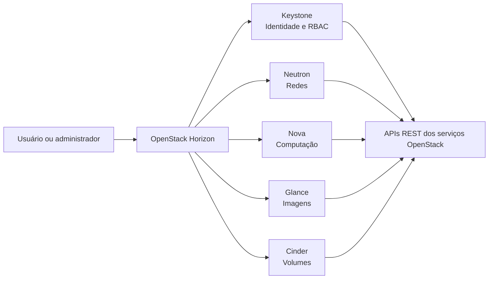

# ☁️ OpenStack Second Brain

## IA aplicada ao estudo de computação em nuvem

[](https://docs.openstack.org/2025.1/)
[](https://notebook.google.com/)
[](https://www.markdownguide.org/)

> Projeto desenvolvido como parte do desafio **“Entendendo uma IA de Aprendizagem: Explore o Poder do NotebookLM”**, promovido pela [DIO — Digital Innovation One](https://dio.me), e integrado aos estudos da disciplina de **Computação em Nuvem** do curso de **Desenvolvimento de Sistemas Multiplataforma (DSM)**.

---

## 📌 Sobre o projeto

Este repositório documenta a construção de um **Segundo Cérebro no Google NotebookLM**, utilizado como mentor e sintetizador de conhecimento durante o estudo do OpenStack.

O projeto tem como objeto de análise o **OpenStack Horizon**, dashboard responsável por oferecer uma interface gráfica para o gerenciamento de recursos de uma infraestrutura de nuvem baseada em OpenStack.

A investigação parte de uma questão central:

> **Uma interface gráfica em ambientes de nuvem é apenas uma camada de conveniência ou representa um componente arquitetural relevante para a operação, a governança e a adoção da infraestrutura?**

---

## 🎯 Objetivo

Sintetizar a arquitetura e o papel operacional do **OpenStack Horizon** em comparação com dashboards de provedores como **AWS, Microsoft Azure e Google Cloud**, estruturando uma análise crítica para uma apresentação técnica de aproximadamente **20 minutos**.

A análise considera os seguintes aspectos:

- consumo de APIs REST;
- desacoplamento entre interface e infraestrutura;
- autenticação e autorização;
- controle de acesso baseado em funções — RBAC;
- governança e aplicação de políticas;
- abstração da complexidade operacional;
- extensibilidade e modelo de desenvolvimento;
- relação entre GUI, API-first e automação.

---

## 🎓 Contexto acadêmico

A apresentação foi organizada a partir de quatro eixos temáticos:

1. **O papel do dashboard na arquitetura de nuvem**
   - Como o Horizon se comunica com os serviços OpenStack por meio de APIs.
   - Por que o dashboard não é o responsável por armazenar o estado da infraestrutura.

2. **Comparação entre provedores**
   - Como OpenStack, AWS, Azure e Google Cloud implementam suas camadas de gerenciamento.

3. **Tabela comparativa**
   - Contraste entre modelos de operação, abstração, extensibilidade e governança.

4. **Discussão crítica**
   - Avaliação da GUI como instrumento de conveniência, self-service, segurança e adoção da nuvem.

---

## 🏗️ Visão conceitual da arquitetura

O Horizon atua como uma camada de apresentação. Ele não substitui os serviços de infraestrutura nem elimina o uso de APIs, mas oferece uma experiência visual para que usuários e administradores possam interagir com esses serviços.



Essa separação evidencia que o dashboard funciona como um **cliente visual das APIs**, enquanto a execução das operações permanece sob responsabilidade dos serviços da plataforma OpenStack.

---

## 🧠 Diretriz de comportamento da IA

Para garantir respostas fundamentadas e tecnicamente consistentes, o NotebookLM foi configurado com a seguinte diretriz:

```text
Comporte-se como um professor especialista em nuvens e seus principais provedores públicos.
Entregue conhecimento em OpenStack, AWS, Azure, Oracle Cloud, Google Cloud, entre outros
provedores populares.
Ensine, explique, tire dúvidas, revise conteúdos, prepare simulados e auxilie na compreensão
arquitetural e operacional dos serviços de computação em nuvem.
```

---

## 📚 Curadoria das fontes

A seleção das fontes considerou atualidade, autoridade técnica, aderência ao tema e compatibilidade com a versão estudada.

### Fontes selecionadas

- 🌐 [OpenStack Official Portal](https://www.openstack.org/): visão institucional dos projetos mantidos pela OpenInfra Foundation.
- 📖 [OpenStack Documentation — 2025.1 Epoxy](https://docs.openstack.org/2025.1/index.html): documentação oficial da versão utilizada como referência.
- 🎥 [Curso completo de OpenStack](https://www.youtube.com/watch?v=_gWfFEuert8): conteúdo audiovisual para fundamentação teórica e prática.
- 🎥 [Hands-on OpenStack Horizon](https://www.youtube.com/watch?v=MUQ0Ev5iM30): demonstração prática da operação do dashboard.

### Critérios de descarte

Foram evitadas fontes que apresentassem alto risco de desatualização ou baixa rastreabilidade técnica, incluindo:

- artigos colaborativos sem revisão técnica especializada;
- materiais sem indicação clara de versão;
- tutoriais antigos com comandos potencialmente descontinuados;
- conteúdos que não distinguissem conceitos de OpenStack de conceitos específicos de provedores públicos.

---

## 🚀 Resultados produzidos no NotebookLM

A partir das fontes selecionadas, foram produzidos os seguintes materiais para a apresentação:

### 1. Roteiro de apresentação

Estrutura temporal organizada em blocos:

- introdução à arquitetura de nuvem;
- funcionamento e papel do Horizon;
- comparação entre provedores;
- debate crítico sobre interfaces gráficas;
- conclusão e sessão de perguntas.

### 2. Proposta de conteúdo para os slides

Tópicos objetivos, sugestões de abordagem e direcionamentos visuais para evitar excesso de texto e favorecer a compreensão dos conceitos.

### 3. Comparação entre dashboards

Análise do OpenStack Horizon em relação ao AWS Management Console, Azure Portal e Google Cloud Console, considerando:

- modelo de operação;
- grau de abstração;
- extensibilidade;
- integração com APIs;
- controle de acesso;
- público-alvo;
- relação com automação e infraestrutura como código.

### 4. Fundamentação para o debate crítico

Argumentos técnicos sobre o papel do dashboard na disponibilização de um portal self-service, na aplicação de políticas de **Role-Based Access Control (RBAC)** por meio do Keystone e na democratização do consumo de recursos de nuvem sem abandonar a filosofia **API-first**.

---

## 📊 Síntese comparativa

| Aspecto | OpenStack Horizon | Consoles de nuvens públicas |
|---|---|---|
| Modelo | Open source e modular | Serviços proprietários integrados ao provedor |
| Extensibilidade | Elevada, com integração ao ecossistema Django/Python | Condicionada aos recursos e extensões oferecidos pelo provedor |
| Operação | Interface para serviços OpenStack expostos por APIs | Interface centralizada para serviços do provedor |
| Controle de acesso | Integrado ao Keystone e ao modelo de projetos, usuários e funções | Integrado ao sistema de identidade e políticas de cada provedor |
| Abstração | Pode ser adaptada conforme a implantação | Geralmente otimizada para a experiência do provedor |
| Automação | Complementar ao uso de APIs, CLI e ferramentas de infraestrutura como código | Complementar às APIs, CLIs e ferramentas nativas do provedor |

> A tabela apresenta uma síntese conceitual para fins acadêmicos. Os recursos disponíveis podem variar conforme a versão, a configuração e o modelo de implantação utilizado.

---

## 💡 Principais aprendizados

> “A experiência com o NotebookLM foi surpreendente. Antes da ferramenta, existia uma sensação de estar perdido sobre onde pesquisar e no que focar diante da imensidão do OpenStack. A ferramenta permitiu filtrar o ruído, concentrar o estudo no que era essencial para a disciplina e transformar a preparação do trabalho em um processo real e profundo de aprendizado.”

- **Pesquisa aumentada:** o NotebookLM ajudou a organizar o conhecimento com base nas fontes selecionadas, reduzindo o ruído de materiais dispersos.
- **Aprendizagem orientada por fontes:** a ferramenta permitiu consultar e sintetizar conteúdos previamente curados.
- **Visão arquitetural:** a interface gráfica foi compreendida como um cliente de APIs e não apenas como uma coleção de telas.
- **Governança e self-service:** dashboards podem facilitar o consumo controlado da infraestrutura e aproximar diferentes perfis de usuários da nuvem.
- **API-first:** a existência de uma GUI não elimina APIs, CLI ou automação; ela oferece uma camada adicional de interação.

---

## 🔗 Acesso ao NotebookLM

[Visualizar o projeto no NotebookLM](https://notebook.google.com/notebook/5f6d5b04-68f1-4883-a94c-2e9dadeb6a36)

> Observação: o acesso ao notebook pode depender das permissões configuradas pelo proprietário.

---

## 🛠️ Tecnologias e ferramentas

- [Google NotebookLM](https://notebook.google.com/): organização de fontes, síntese de conhecimento e preparação do roteiro.
- [OpenStack Horizon](https://docs.openstack.org/horizon/latest/): dashboard open source para interação com serviços OpenStack.
- [Markdown](https://www.markdownguide.org/): estruturação da documentação.
- [GitHub](https://github.com/): versionamento e publicação do projeto.

---

## 👨‍💻 Autor

**Thiago Lima de Carvalho Bastos Luiz**  
Estudante de Desenvolvimento de Sistemas Multiplataforma.

- [LinkedIn](https://linkedin.com/in/thibastos0)
- [GitHub](https://github.com/thibastos0)

---

## 📄 Licença

Este repositório possui finalidade acadêmica e educacional. Consulte o conteúdo e as fontes referenciadas para obter informações técnicas atualizadas sobre cada projeto.
